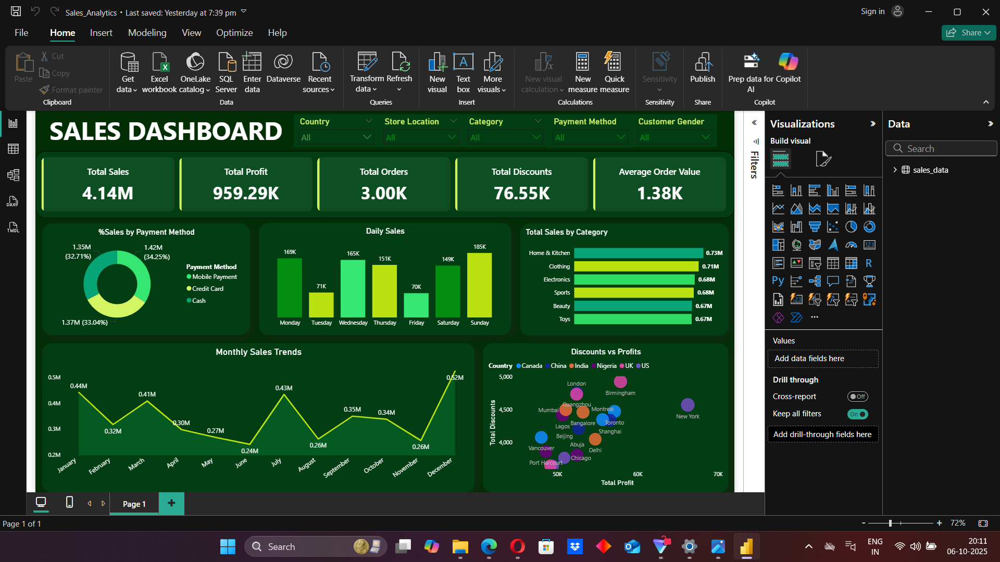

# Sales Analytics Dashboard (MySQL + Power BI)

## Project Overview
This project consolidates sales data from 6 countries, cleans it using MySQL, and visualizes key insights in Power BI.

## Dataset
- Columns include Transaction ID, Date, Country, Product Name, Category, Price, Quantity, Cost, Discount, Payment Method, Customer info, Store Location, and Sales Representative.
- Sample anonymized CSVs included for demonstration.

## SQL Workflow
1. Merge country datasets into one table.
2. Handle missing values and duplicates.
3. Add calculated columns: `Total amount` & `Profit`.
4. Run analytical queries for insights:
   - Revenue & Profit by Country
   - Top 5 Products
   - Best Sales Representatives
   - Top Store Locations
   - Key Sales & Profit Statistics

## Power BI Dashboard
- Visualizes KPIs, revenue/profit by country, product sales, top stores, and representative performance.

